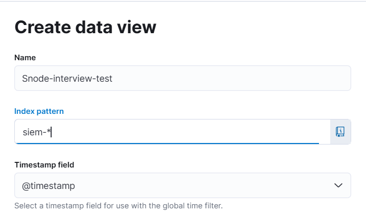
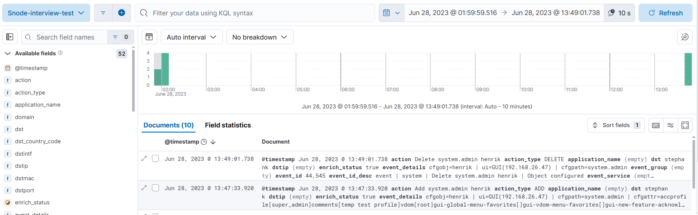
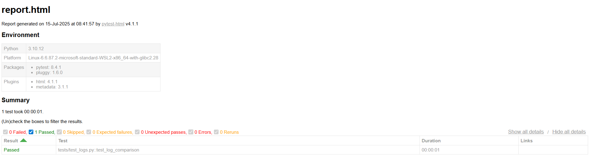
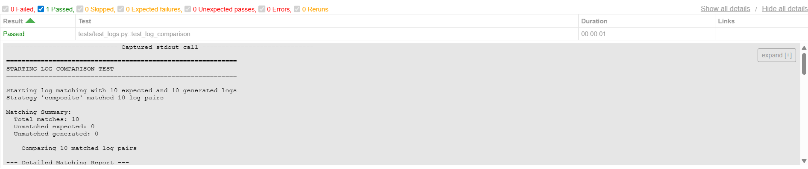

# Snode-interview-test

## Overview
Normalization of Fortigate firewall data (`input.log`). The firewall data
consists of `authentication`, `configuration`and `firewall` logs which are
normalized according to a respective schema. This repository also contains
tests which are used to validate the normalization of the logs. The repository
structure looks as follows:

```shell
.
├── Dockerfile.pytest
├── README.md
├── docker-compose.yaml
├── images
│   └── create-data-view.png
├── input.log
├── outputs
│   └── example
│       └── output.log
├── requirements.txt
├── tests
│   ├── expected_logs
│   │   └── output.log
│   ├── test_logs.py
│   └── test_results
│       └── report.html
└── vector
    └── vector.toml
```

## Run the application
The application is wrapped in a docker container for convenience. Prior to
running the application, ensure docker is installed. If docker is not installed,
the following link to [install docker](https://docs.docker.com/engine/install/)
can be followed. Once installed, simply run the following in the `root` of the
repo:

```shell
# pwd: ../snode-interview-test/
docker-compose up --build
```

Vector is configured to sink the transformed logs to an Elasticsearch database
with a Kibana supervisor. Ensure the following:

> [!IMPORTANT]
> Elasticsearch may take a few moments to start up.

**Verify Elasticsearch is running**:
- Open your browser and navigate to [http://localhost:9200](http://localhost:9200).
  You should see a JSON response with cluster information such as:
  ```json
    {
    "name" : "f1d99c890723",
    "cluster_name" : "docker-cluster",
    "cluster_uuid" : "IuXpNGQrQ7e7_EamvhpB1w",
    "version" : {
        "number" : "8.14.0",
        "build_flavor" : "default",
        "build_type" : "docker",
        "build_hash" : "8d96bbe3bf5fed931f3119733895458eab75dca9",
        "build_date" : "2024-06-03T10:05:49.073003402Z",
        "build_snapshot" : false,
        "lucene_version" : "9.10.0",
        "minimum_wire_compatibility_version" : "7.17.0",
        "minimum_index_compatibility_version" : "7.0.0"
    },
    "tagline" : "You Know, for Search"
    }
  ```
**Access Kibana**:
- Open your browser and navigate to [http://localhost:5601](http://localhost:5601).

## View the output logs
At this point, the output logs are within the Elasticsearch database. To view
these log entries, this can be done via Kibana:

* If it's your first time, click "Explore on my own" or similar.
* In the left-hand navigation, go to **Stack Management** -> **Kibana**
-> **Data Views**.
* Click "Create data view" and fill in the fields as follows:
    
* Click "Save data view to Kibana".
* Once created, go to **Analytics** -> **Discover** to view your normalized
  Fortigate logs.
* If nothing displays, there should be a blue button **View all matches**, click
  the button and the logs will display.

The logs will appear on Kibana as follows:
    

An example `output.log` generated using this application is also located in
`snode-interview-test/outputs/examples/output.log`, which may be used as a
reference.

## Testing

Tests are located within `tests/test_logs.py`.

### Overview

The `test_logs.py` module provides comprehensive testing for log processing and
validation by comparing expected log outputs against logs generated and stored
in Elasticsearch. This test suite is designed to handle the complexities of
log matching in real-world scenarios where timestamps may have precision
differences, processing order variations, etc.

### What It Does

The test suite validates logs by:

1. **Fetching Generated Logs**: Retrieves logs from Elasticsearch indices
matching the pattern `siem-*`
2. **Loading Expected Logs**: Reads expected log entries from
`/app/tests/expected_logs/output.log`
3. **Intelligent Log Matching**: Uses multiple strategies to match expected
logs with generated logs
4. **Deep Comparison**: Performs detailed field-by-field comparison of matched
log pairs
5. **Comprehensive Reporting**: Provides detailed reports on matches,
mismatches, and discrepancies

### How It Works

### Multi-Strategy Log Matching

When testing, it was identified that log order is not guaranteed and due to
possible normalization errors (commonly seen with the `@timestamp`) in the
expected logs, a multi log-matching strategy was implemented to ensure
corresponding logs were compared.

1. **Composite Identifier (Highest Priority)**
   - Creates identifiers using multiple log fields: `action`, `src`, `dst`,
     `srcport`, `dstport`, `event_id`, `user`, etc.

2. **Content Hash**
   - Generates MD5 hash of log content excluding timestamp and Elasticsearch
     metadata

3. **Fuzzy Timestamp Matching**
   - Rounds timestamps to nearest 100ms and combines with key identifying
     fields

4. **Truncated Timestamp (Fallback)**
   - Simple timestamp truncation to 6 digits precision

### Timestamp Handling

Special attention is given to timestamp processing due to common precision
issues:
- **Nanosecond Truncation**: Handles timestamps with 9+ digit precision by
  truncating to 6 digits
- **Timezone Normalization**: Converts `Z` format to `+00:00` for consistent
  parsing
- **Tolerance Checking**: Allows up to 2ms difference between expected and
  generated timestamps

## Pass/Fail Criteria

### Test Passes When:
- At least one log can be successfully matched between expected and generated
  sets
- The matching process completes without critical errors

### Test Reports Issues For:
- **Field Differences**: Any non-timestamp field that differs between matched
  logs
- **Timestamp Discrepancies**: Timestamp differences exceeding 2ms tolerance
- **Missing Expected Logs**: Expected logs that couldn't be matched with any
  generated log
- **Unexpected Generated Logs**: Generated logs that don't match any expected
  log

### Test Fails When:
- No logs can be matched between expected and generated sets

## Test Results

The test results can be found within the `tests/test_results/` directory which
will contain a `report.html` file.
To view the logs, please open the report within a browser. It should look like:


Please click on the line `tests/test_logs.py::test_log_comparison`. This will
display the test's standard output:


## Clean Up
The docker compose can be shutdown as follows:

```shell
# Cntrl + C -> Stops the containers
# Remove the containers
docker-compose down
# OPTIONAL: Clean persistent log data from ElasticSearch
docker volume rm snode-interview-test_esdata
```

## Report Analysis

### Key Normalization Observations and Challenges

#### Timestamp Normalization

The `@timestamp` field is crucial for chronological event correlation. During
this assessment, inconsistencies were observed in the expected output file
regarding the precision and rounding of this timestamp.

**Observation**: The expected `output.log` often presents timestamps with
fractional seconds that appear to be rounded to microseconds
(e.g., 2023-06-28T11:45:15.769763500Z), where the last two nanosecond digits
are typically `00`. However, the raw input logs provide `eventtime` with full
nanosecond precision. Custom logic was implemented to attempt to match this
observed behavior by incrementing the microsecond digit if there's any non-zero
value in the hundred-nanosecond place or beyond, then padding the result to
maintain a specific 9-digit fractional representation ending in 00.

**Impact**: This custom rounding logic can lead to subtle mismatches in
automated tests (as seen) and may not be universally understood or
maintainable. The current test suite employs a tolerance to accommodate these
slight variations, mitigating test failures but highlighting the underlying
inconsistency. For example, the following is seen within the test report:

```shell
Timestamp Issue: Timestamp difference beyond tolerance: expected='2023-06-27T23:59:59.626927Z', generated='2023-06-27T23:59:59.626926900Z'
```

##### Suggestions to address timestamp rounding
To ensure robust and widely-understood timestamp normalization:

**Define a Consistent Standard**: Establish a clear, single standard for
`@timestamp` precision (e.g., always nanosecond, microsecond, or millisecond).

If nanosecond precision is desired (given `eventtime` provides it), the
normalization logic should simply convert `eventtime` directly to an `ISO 8601`
string with full nanosecond precision, without any custom rounding.

If microsecond precision (6 decimal places) is preferred, implement a standard
rounding method (e.g., "round half up" to the nearest microsecond).

#### Protocol Field (proto) Consistency

The `proto` field indicates the network protocol.

**Observation**: The raw input logs contain the `proto` field with integer
values (e.g., proto=6 for TCP, proto=17 for UDP). However, the expected
output log file often shows this field as empty or missing, indicating that the
`proto` data is not being consistently enriched or retained during
normalization.

**Impact**: Failing to normalize the `proto` field diminishes the analytical
value of the logs, making it harder to filter, correlate, or build security
rules based on network protocols.

##### Suggestions to address missing proto field

Ensure the normalization logic consistently extracts the integer proto value
from the raw logs.

#### Severity Mapping

The severity field is critical for prioritizing alerts and understanding the
criticality of events.

**Observation**: Initial inspection suggested a direct mapping from the raw
`level` field (e.g., "information", "notice", "warning") to severity. However,
a more nuanced logic was found to be necessary to match the severity values
(e.g., "LOW", "MEDIUM", "HIGH") present in the output logs. This implies that
severity might be influenced by factors beyond just the `level` field.

**Impact**: An inconsistent or unclear mapping for severity can lead to
misprioritization of security events - this was initially seen during
normalization. In a real-world scenario this cabn potentially obscure critical
incidents or generate excessive noise from low-priority events.

##### Suggestions to address severity

**Explicit Mapping Rules**: Document the precise rules and logic used to derive
`severity`. This documentation should clearly outline which input fields
(e.g., level, type, subtype, logid, specific action values) contribute to the
final `severity` assignment.

#### Field Type Standardization

Consistent data types are essential for effective querying and analysis in
Elasticsearch.

**Observation**: Fields like srcport, dstport, rcvdbyte, and sentbyte might
sometimes be represented with inconsistent data types (e.g., numbers as
strings, or integers vs. floats).

**Impact**: Inconsistent data types hinder numerical aggregations, range
queries and accurate filtering.

##### Suggestions

**Strict Type Coercion**: Implement explicit type coercion in the
normalization logic to ensure all numeric fields are correctly parsed as
integers or floats, and string fields remain strings. This will depend on an
agreed-upon standard.

#### Handling of Null, Empty, and Missing Values

**Observation**: The `EXCLUDE_PATHS_FOR_DEEPDIFF` list (e.g., ap, app,
dstcountry, ...) within the tests consists of fields that frequently vary
between null, empty strings (""), or complete absence.

##### Suggestions

**Standardize Null/Empty Representation**: Define a clear convention for
representing missing or empty data (e.g., always null, always an empty string
"", or always omitting the field if it has no value).

### Areas for Improvement

#### VRL Codebase Structure

**Current State**: All normalization logic for transformations and schema
mapping is currently consolidated within a single `.toml` file.

**Proposed Improvement**: Investigate the feasibility of modularizing the
Vector Remap Language (VRL) code. Ideally, the transformation logic should be
split into separate `.toml` files per log type (e.g., dedicated files for
authentication, configuration, and firewall logs).

**Benefits**: This modular approach significantly enhances code
maintainability and readability by grouping related logic. It makes the main
`.toml` file cleaner and easier to navigate.

#### Elasticsearch Security Configuration

**Current State**: For assessment purposes, security features within
Elasticsearch are currently disabled.

**Proposed Improvement**: In a production environment, it is imperative to
enable and rigorously configure Elasticsearch security.

**Benefits**: Implementing these security measures would protect sensitive log
data, ensure data integrity, and comply with security policies.
